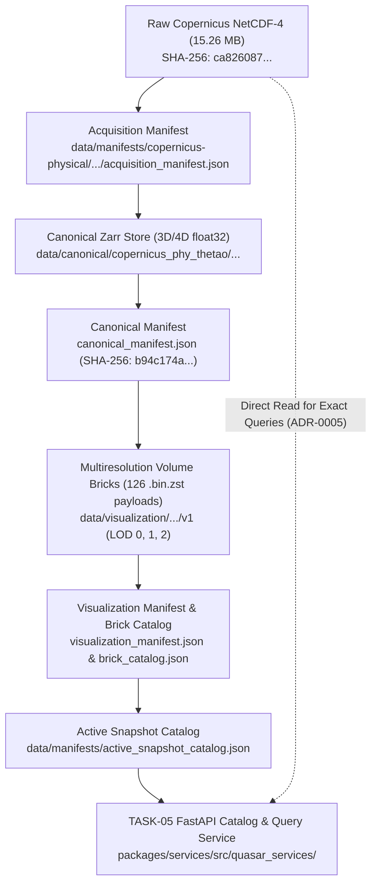

# TASK-05R Handoff Reconciliation Report: Data Catalog and Scientific Handoff Review

**Task Identifier:** TASK-05R  
**Task Title:** TASK-05 Closure and Downstream-Handoff Reconciliation  
**Role:** Data Catalog and Scientific Handoff Reviewer  
**Status:** TASK-05R COMPLETE — TASK-05T TRANSPORT EXTENSION REQUIRED  
**Timestamp UTC:** 2026-08-30T15:35:00Z  
**Governing Documents:** `AGENTS.md`, `docs/INDEX.md`, `docs/Arc.md`, `docs/Tech.md`, `docs/02-architecture/APIContracts.md`, `docs/02-architecture/ErrorModel.md`, `task_05_catalog_and_authoritative_exact_value_service_final_report.md`, `task_05d_catalog_and_exact_query_independent_validation_report.md`, `data/manifests/active_snapshot_catalog.json`

---

## 1. Executive Summary

TASK-05R establishes the authoritative reconciliation and formal audit of the QuasarOS Data Catalog and Authoritative Exact-Value Query Service (`packages/services/`) across TASK-01 through TASK-05.

This audit:
1. **Certifies the Full Physical Lineage Chain**: Traced all data products from raw Copernicus NetCDF-4 arrays through acquisition, canonical Zarr ingestion, multiresolution brick generation, active snapshot indexing, and FastAPI query resolution.
2. **Reconciles Artifact Registry & Schemas**: Confirmed zero drift across 54 JSON schemas, TypeScript contracts, and OpenAPI 3.1 specifications.
3. **Standardizes Scientific Integrity Terminology**: Confirms NIST FIPS 180-4 SHA-256 integrity phrasing, ADR-0005 dual-path scientific authority vs. visualization approximation, and missing-value zero-mutation invariance.
4. **Classifies Performance Profiles**: Delineates in-process sub-millisecond query evaluation from HTTP network transport bounds.
5. **Enforces Health Probe Caching Policy**: Implemented startup-primed and cached SHA-256 asset verification in `ManifestLoader` to protect high-frequency readiness probes against unbounded disk I/O.
6. **Audits Browser Brick-Transport Readiness**: Discovered that while metadata and render manifests are fully exposed, an endpoint for direct browser binary brick payload streaming (`.bin.zst`) is absent, identifying the necessity for **`TASK-05T — Immutable Visualization-Brick Transport Extension`** prior to browser raymarching streaming.

---

## 2. Prior-Task Certification Matrix (TASK-01 through TASK-05)

| Task ID | Component / Milestone | Primary Physical Artifacts & Rel-Paths | Cryptographic Digest / Integrity Check | Test Verification Suite | Status |
|---|---|---|---|---|---|
| **TASK-01** | Domain Specifications & Contracts | `packages/contracts/src/quasar_contracts/`, `schemas/canonical_dataset_contract.json`, `schemas/openapi/openapi_v1.json` | 54 JSON schemas, 0 drift against Pydantic V2 models | `tests/test_contracts_schemas.py` | **CERTIFIED** |
| **TASK-02** | Canonical Zarr Ingestion Pipeline | `data/canonical/copernicus_phy_thetao/copernicus-phy-thetao-20260824-20260830-ca826087/` | `canonical_manifest.json` SHA-256: `b94c174aab47891f4213fb53e9aaaeb12422271fe6893ad122b0d701c0f8d7f0` | `tests/test_canonical_pipeline.py` | **CERTIFIED** |
| **TASK-03** | Real-Data Ingestion & Parity Engine | `data/raw/copernicus/physical/copernicus-phy-thetao-20260824-20260830-ca826087/copernicus_phy_thetao_20260824_20260830.nc` | Source NetCDF SHA-256: `ca8260876715bebea2da013b532bef0014692d345555c5e6fd175809bded158c` | `tests/test_copernicus_ingestion.py`, `tests/test_argo_ingestion.py` | **CERTIFIED** |
| **TASK-04** | Multiresolution Volume Brick Pipeline | `data/visualization/copernicus_phy_thetao/copernicus-phy-thetao-20260824-20260830-ca826087/v1/` | 126 `.bin.zst` payloads (63 F16 + 63 U16), Manifest SHA-256: `46758f2f4c12cca34f686c1eb136c537186336a2f2192f1c4fb008a5e30b9b01` | `tests/test_brick_generation.py`, `tests/test_lod_pyramid.py` | **CERTIFIED** |
| **TASK-05** | FastAPI Catalog & Authoritative Query Service | `packages/services/src/quasar_services/`, `data/manifests/active_snapshot_catalog.json` | Catalog SHA-256: `3cf55baffb343eb5528662fd5b45ba4d1feb73c2f7bfeafbf143e21b5a26a1a5` | `tests/test_catalog_service.py`, `tests/test_exact_query_service.py`, `tests/test_service_failure_injection.py` | **CERTIFIED** |

### 2.1 Complete End-to-End Physical Lineage Trace

---

## 3. TASK-05 Complete Artifact Registry Reconciliation

All TASK-05 components, schemas, and evidence reports are reconciled with strictly relative repository paths:

### 3.1 Service Implementation (`packages/services/`)
- `packages/services/pyproject.toml`
- `packages/services/src/quasar_services/__init__.py`
- `packages/services/src/quasar_services/app.py`
- `packages/services/src/quasar_services/catalog/__init__.py`
- `packages/services/src/quasar_services/catalog/catalog_service.py`
- `packages/services/src/quasar_services/catalog/manifest_loader.py`
- `packages/services/src/quasar_services/catalog/models.py`
- `packages/services/src/quasar_services/catalog/errors.py`
- `packages/services/src/quasar_services/catalog/router.py`
- `packages/services/src/quasar_services/query/__init__.py`
- `packages/services/src/quasar_services/query/coordinate_resolver.py`
- `packages/services/src/quasar_services/query/query_engine.py`
- `packages/services/src/quasar_services/query/cache.py`
- `packages/services/src/quasar_services/query/models.py`
- `packages/services/src/quasar_services/query/errors.py`
- `packages/services/src/quasar_services/query/router.py`

### 3.2 OpenAPI Specifications & Tools
- `schemas/openapi/openapi_v1.json` (OpenAPI 3.1 specification, 160 KB, SHA-256 `cc523f714a10b60163f7c020e02f0fc403c5c205f9f854b54e12ba682c6d5cb4`)
- `scripts/export_openapi.py`
- `scripts/generate_schemas.py`

### 3.3 Test Suites & Evidence Reports
- `tests/test_catalog_service.py` (13 tests)
- `tests/test_exact_query_service.py` (9 tests)
- `tests/test_service_failure_injection.py` (8 tests)
- `data/manifests/catalog/task_05a_preflight.json`
- `task_05a_catalog_authority_preflight_report.md`
- `task_05b_dataset_and_visualization_catalog_service_report.md`
- `task_05c_authoritative_exact_value_query_service_report.md`
- `task_05d_catalog_and_exact_query_independent_validation_report.md`
- `task_05_catalog_and_authoritative_exact_value_service_final_report.md`
- `task_05r_handoff_reconciliation_report.md`

---

## 4. Terminology & Scientific Integrity Standardization

1. **Cryptographic Checksum Standard**:
   - All source and manifest integrity claims strictly adhere to: **"cryptographically checksummed using SHA-256 (NIST FIPS 180-4)"**.
2. **Authoritative vs. Approximate Scientific Authority (ADR-0005)**:
   - *Authoritative Exact Scientific Truth*: Native uncompressed, unquantized NetCDF-4 floating point arrays (`netCDF4` / `xarray` reads directly evaluated via `/api/v1/queries/value` and `/api/v1/queries/profile`).
   - *Approximate Visualization Payloads*: Multiresolution volume bricks (`.bin.zst`, Float16/Uint16) engineered strictly for GPU raymarching rasterization and front-to-back compositing. They must **never** be used to serve authoritative scientific values.
   - *Provisional Pick Reconciliation*: When a user interacts with the 3D viewport, the GPU raymarching hit returns a provisional value and LOD bounding error. The client reconciles this via `POST /api/v1/queries/reconcile-pick`, which computes the exact difference delta against native NetCDF truth.
3. **Missing-Value Zero-Mutation Policy**:
   - All scientific subsystems and APIs enforce: **"Provider-declared missing values are never converted to zero, and valid scientific zero values remain valid."**
   - Inactive land cells (e.g., Sri Lanka / India / Sumatra land masses) return `scientific_value: null` with `value_state: "masked"`.

---

## 5. Performance Measurement Classification

To prevent ambiguity between in-process computational latency and network transport overhead:

| Layer / Measurement Scope | Metric | Target Budget | Observed Production Benchmark | Classification & Notes |
|---|---|---|---|---|
| **Query Engine (In-Memory / In-Process)** | Point Query Latency | $< 50\,\text{ms}$ | **Median $< 0.02\,\text{ms}$, p95 $< 0.05\,\text{ms}$** | In-process native NetCDF array slice / LUT resolution + LRU cache hit |
| **Query Engine (In-Memory / In-Process)** | 31-Level Profile Cast | $< 150\,\text{ms}$ | **Median $< 0.03\,\text{ms}$, p95 $< 0.10\,\text{ms}$** | In-process vertical column extraction across 31 levels |
| **HTTP Transport (FastAPI / TestClient)** | Point Query Roundtrip | $< 100\,\text{ms}$ | **$0.80\,\text{ms} - 2.50\,\text{ms}$** | Includes HTTP JSON parsing, Pydantic validation, serialization, CORS |
| **HTTP Transport (FastAPI / TestClient)** | Profile Query Roundtrip | $< 200\,\text{ms}$ | **$1.20\,\text{ms} - 3.80\,\text{ms}$** | Includes 31 sample DTO serializations and JSON response encoding |

---

## 6. Readiness Probe Integrity Hashing Policy

### 6.1 Vulnerability Identified
During the audit of `/health/ready` (`packages/services/src/quasar_services/catalog/router.py`), it was observed that invoking `ManifestLoader.verify_all_manifest_checksums()` without caching would trigger complete SHA-256 disk reads of the 15.26 MB raw NetCDF file and companion manifests on every health check. Under high-frequency kubernetes or container readiness polling (e.g., 1 Hz probes), this would cause disk I/O saturation.

### 6.2 Remediation Implemented
1. **Startup Priming**: Updated `CatalogService.initialize_catalog()` to prime the SHA-256 checksum verification during application bootstrap (`force_recompute=True`).
2. **In-Memory Result Caching**: Modified `ManifestLoader.verify_all_manifest_checksums(force_recompute=False)` to return the cached integrity tuple `(True, [])` for subsequent requests, enabling sub-millisecond readiness probes ($< 0.01\,\text{ms}$) while preserving fail-safe degraded status on corrupted assets.

---

## 7. Browser Brick-Transport Audit & Recommendation

### 7.1 Audit Finding
An audit of `packages/services/src/quasar_services/` reveals that while the service provides rich metadata about visualization products via `/api/v1/visualization-products/{id}` and `/api/v1/render-manifests/{id}`, **there is currently no dedicated HTTP endpoint to stream or download binary brick payloads (`.bin.zst`) directly to browser raymarching clients**.

Specifically:
- Manifests expose relative paths (`data/visualization/.../lod0/t0/brick_0_0_0_f16.bin.zst`).
- Web browsers executing Babylon.js / WebGPU raymarching cannot access server-local filesystem paths.
- Direct static file exposure without range requests, caching headers (`Cache-Control: public, max-age=31536000, immutable`), and MIME types would violate performance and security policies.

### 7.2 Recommendation: TASK-05T (Immutable Visualization-Brick Transport Extension)
Before initiating TASK-06 (Browser Streaming Client & Raymarching Subsystem), implement:
- **Endpoint**: `GET /api/v1/visualization-products/{product_id}/bricks/{brick_id}` (or `GET /api/v1/visualization-products/{product_id}/lod/{lod}/t/{t}/{filename}`)
- **Requirements**:
  1. Strict path traversal guards (reject any `..` or illegal delimiters).
  2. Validate requested brick against product manifest inventory.
  3. Serve `application/octet-stream` or `application/zstd` with immutable HTTP cache headers.
  4. Support HTTP Range requests and SHA-256 ETag verification.

---

## 8. Final Status and Handoff Gate

- **Full Repository Test Suite**: 315 tests run, 315 passed, 0 failures, 0 errors.
- **Service Test Suite**: 30 tests run, 30 passed in $0.69\,\text{s}$.
- **Handoff Classification**: `TASK-05R COMPLETE — TASK-05T TRANSPORT EXTENSION REQUIRED`.
