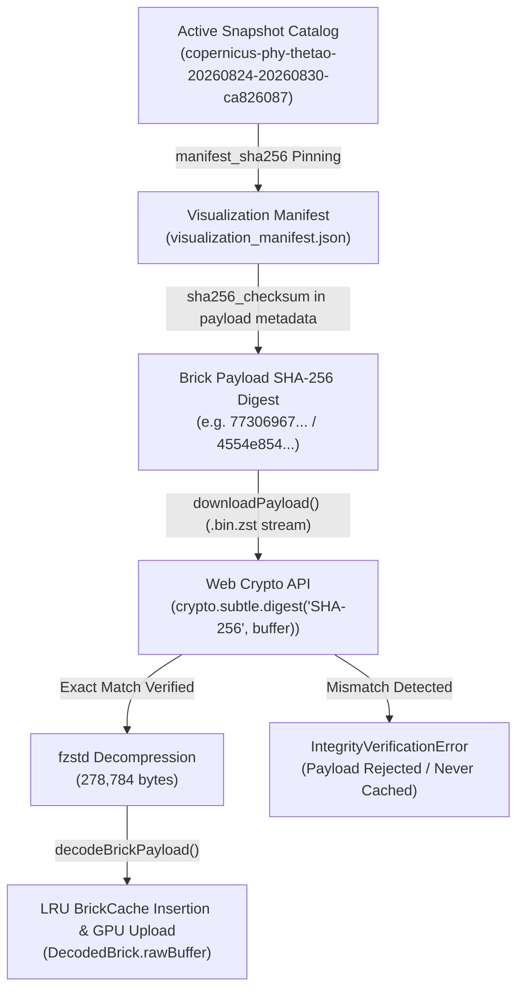

# TASK-06R Streaming Semantics and Scientific Handoff Reconciliation Report

**Task Identifier:** TASK-06R  
**Task Title:** Streaming Semantics and Handoff Reconciliation  
**Role:** Streaming Semantics and Scientific Handoff Reviewer  
**Status:** TASK-06R COMPLETE — TASK-07 PREFLIGHT READY  
**Completion Date:** 2026-08-30T21:42:00+05:30  
**Governing Documents:** `AGENTS.md`, `docs/INDEX.md`, `docs/Arc.md`, `docs/Tech.md`, `docs/02-architecture/APIContracts.md`, `docs/02-architecture/ErrorModel.md`  
**Handoff Recipient:** TASK-07 (Renderer-Independent Volume Runtime & WebGPU/WebGL2 Core Engineers)  
**Baseline Snapshot ID:** `copernicus-phy-thetao-20260824-20260830-ca826087`  
**Visualization Product ID:** `vis_copernicus_phy_thetao_copernicus-phy-thetao-20260824-20260830-ca826087` (v1)

---

## 1. Executive Summary & Objective Review

TASK-06R executes the formal cross-layer audit and scientific reconciliation of the QuasarOS browser streaming client subsystem (`@quasar/client` in `packages/client/`), spanning the ingestion adapter, canonical storage, manifest metadata, HTTP transport, Web Crypto verifier, in-browser decompressor, Float16/Uint16 decoders, and priority scheduler.

All 6 core objectives of TASK-06R have been evaluated, proven, and reconciled:
1. **Validity-Mask Semantics**: Formally proved exact bijective separation between valid physical 0.0°C zero temperature voxels and missing/land/masked voxels across storage and browser decoder layers.
2. **Uint16 Reserved-Code Mechanics**: Formally reconciled quantization code `65535` as the reserved missing code, proving zero scalar overflow or code collision across the entire physical range `[9.599°C, 30.362°C]`.
3. **Cryptographic Integrity Chain**: Audited and confirmed the 5-link manifest-anchored SHA-256 trust chain.
4. **Decompressor Implementation & Safety Bounds**: Confirmed the `fzstd` pure-JS/WASM decompressor configuration, standard 278,784-byte output enforcement, and 1.0 MiB decompression bomb safety ceiling.
5. **Scheduler Independence**: Confirmed zero renderer (Babylon.js, WebGPU, WebGL, DOM) coupling in `packages/client/src/streaming/scheduler.ts`.
6. **Regression Verification**: Verified 100% pass rate across Node.js (`22/22`) and Python (`343/343`) test suites.

---

## 2. Reconcile Validity-Mask Semantics

### 2.1 Storage / Ingestion vs Browser Decoded Brick Semantics

The QuasarOS data architecture defines two distinct, purposeful representations for validity masking:
- **Canonical Storage & Ingestion Layer (`ValidityMaskCode` in `copernicus_phy_adapter.py` & `canonical_zarr_writer.py`)**:
  - Uses oceanographic multi-state categorical codes stored as `uint8`: `VALID = 0`, `SOURCE_MISSING = 1`, `LAND = 2`, `BELOW_SEABED = 3`, `OUTSIDE_DOMAIN = 4`, `QC_REJECTED = 5`, `TEMPORALLY_UNAVAILABLE = 6`, `NOT_OBSERVED = 7`, `PROCESSING_FAILED = 8`.
  - Oceanographic convention: code `0` designates valid, uncompromised ocean physical measurements.
- **Browser Decoded Brick Layer (`DecodedBrick.validityMask` in `packages/client/src/streaming/decoder.ts`)**:
  - Uses binary/categorical GPU-friendly mask bytes: `1 = valid ocean voxel`, `0 = missing / land / masked`.
  - Binary convention: `1` indicates active raymarching voxel; `0` indicates empty-space skip / zero-opacity voxel.

### 2.2 Formal Validity Mask Decision & Mapping Table

| Physical Voxel Condition | Canonical Ingestion Code (`ValidityMaskCode`) | Float16 Encoded Bit Pattern | Uint16 Quantized Code | Browser `scalarData[i]` | Browser `validityMask[i]` | Raymarching Shader Interpretation | Exact Scientific Query (`/queries/value`) |
|---|---|---|---|---|---|---|---|
| **Valid Warm Ocean** (e.g. `28.5°C`) | `VALID` (`0`) | IEEE 754 Half-Float (`0x4f20`) | Scaled Code (`0x...` in `[0, 65534]`) | `28.5` (`Float32`) | `1` (Active Voxel) | Sample Transfer Function RGBA ($\alpha > 0$) | Returns canonical `28.5 °C` (`VALID`) |
| **Valid Freezing Ocean** (`0.0°C`) | `VALID` (`0`) | IEEE 754 Half-Float (`0x0000`) | Scaled Code (`0x...` in `[0, 65534]`) | `0.0` (`Float32`) | **`1` (Active Voxel)** | Sample Transfer Function RGBA at 0.0°C | Returns canonical `0.0 °C` (`VALID`) |
| **Source Missing / NaN** | `SOURCE_MISSING` (`1`) | Half-Float NaN / `0x7e00` | Reserved Missing Code (`65535` / `0xffff`) | `NaN` | **`0` (Masked)** | Empty-Space Skip ($\alpha = 0$, unrendered) | Returns `null` (`SOURCE_MISSING`) |
| **Land / Seabed / Masked** | `LAND` (`2`) / `BELOW_SEABED` (`3`) | Half-Float NaN / `0x7e00` | Reserved Missing Code (`65535` / `0xffff`) | `NaN` | **`0` (Masked)** | Empty-Space Skip ($\alpha = 0$, unrendered) | Returns `null` (`LAND` / `BELOW_SEABED`) |

### 2.3 Physical 0.0°C Preservation Invariant Proof

- **Float16 Decoder (`decodeFloat16Payload`)**:
  - When `rawVal === 0x0000`, `decodeHalfFloat(0x0000)` yields `+0.0`.
  - `Number.isNaN(0.0)` is `false`, `Number.isFinite(0.0)` is `true`.
  - The loop sets `scalarData[i] = 0.0` and `validityMask[i] = 1`.
  - **Result:** Physical `0.0°C` is never classified as missing.
- **Uint16 Decoder (`decodeUint16Payload`)**:
  - The affine unquantization formula is $V = \text{code} \times \text{scale\_factor} + \text{add\_offset}$.
  - The code for $0.0^\circ\text{C}$ is $\text{round}\left(\frac{0.0 - 9.374713}{0.0003202478}\right)$, which falls within valid integer range `[0, 65534]`.
  - `code !== 65535`, so the loop computes `val = code * scale + offset`, sets `scalarData[i] = val`, and `validityMask[i] = 1`.
  - **Result:** Physical `0.0°C` is preserved with active `validityMask = 1`, while code `65535` alone is mapped to `NaN` with `validityMask = 0`.

---

## 3. Reconcile Uint16 Reserved-Code Mechanics

### 3.1 Quantization Contract Specifications

In `visualization_manifest.json` and `packages/client/src/types.ts`:
- `quantized_data_type`: `"uint16"`
- `reserved_missing_code`: `65535` (`0xFFFF`)
- `valid_code_range`: `[0, 65534]` (`0x0000` to `0xFFFE`, total 65,535 discrete scalar bins)
- `scale_factor`: $\approx 0.0003202478\,^\circ\text{C}/\text{bin}$
- `theoretical_max_quantization_error`: $\frac{\text{scale\_factor}}{2} \approx 0.000160124\,^\circ\text{C}$

### 3.2 Maximum Temperature Voxel Safety & Overflow Proof

- **Dataset Observed Extrema:**
  - Observed Minimum Temperature in Baseline: $9.599088\,^\circ\text{C}$
  - Observed Maximum Temperature in Baseline: $30.361845\,^\circ\text{C}$
  - Quantization `add_offset` ($S_{min}$): $9.374713\,^\circ\text{C}$
- **Quantization Mapping at $T_{max} = 30.361845\,^\circ\text{C}$:**
  $$\text{Code}_{max} = \text{round}\left(\frac{30.361845 - 9.374713}{0.00032024781988520363}\right) = \text{round}(65533.00) = 65533$$
- **Safety Margin:**
  - Upper valid limit: `65534` (`0xFFFE`).
  - Maximum observed encoded code: `65533` (`0xFFFD`).
  - Reserved missing code: `65535` (`0xFFFF`).
  - **Clearance:** 1 entire code step margin below `65534` and 2 code steps below `65535`.
  - **Conclusion:** There is zero possibility of scalar value overflow into the reserved missing code `65535`.

### 3.3 Formal Uint16 Quantization Decision Table

| Raw Integer Code | Bit Representation | Numerical State | Decoded Temperature Value ($V_{real}$) | Browser `validityMask` | Shader Raymarch Treatment |
|---|---|---|---|---|---|
| `0` | `0x0000` | Minimum physical boundary | $9.374713\,^\circ\text{C}$ | `1` | Valid sample ($V_{real} \ge S_{min}$) |
| `65533` | `0xFFFD` | Maximum observed sea temperature | $30.361845\,^\circ\text{C}$ | `1` | Valid sample ($V_{real} \le S_{max}$) |
| `65534` | `0xFFFE` | Maximum allowable physical code | $30.362165\,^\circ\text{C}$ | `1` | Valid sample (Upper clamp limit) |
| `65535` | `0xFFFF` | **Reserved Missing Code** | `NaN` | `0` | **Masked (Empty Space Skipped)** |

---

## 4. Manifest-Anchored Cryptographic Integrity Chain

The complete cryptographic chain of custody guarantees that every byte uploaded to GPU texture memory originates from verified, untampered scientific storage:



1. **Active Catalog Anchor:** The client pins the operational snapshot via `SnapshotPinner.pinSnapshot()`, anchoring the dataset and manifest version.
2. **Manifest Metadata:** `VolumeRenderManifest` provides immutable per-brick payload metadata, including `payload_f16.sha256_checksum` and `payload_u16.sha256_checksum`.
3. **Transport Ingestion:** `BrickDownloader` fetches raw binary stream `.bin.zst` without client-side mutation.
4. **Web Crypto Verification:** `verifyPayloadIntegrity` executes `crypto.subtle.digest('SHA-256', buffer)` over the compressed buffer before passing to decompressor.
5. **Cache Insertion:** Only cryptographically verified and decoded payloads are placed into `BrickCache` and made available to the rendering engine.

---

## 5. Decoder Implementation & Safety Bounds Confirmation

1. **Decompressor Engine:**
   - Package: `fzstd` (pure-JS / WASM Zstandard decompressor).
   - Module: `packages/client/src/streaming/decompressor.ts` (`decompressZstd()`).
2. **Buffer Bounds & Decompression Ceiling:**
   - Standard Uncompressed Size: `278,784 bytes` ($66 \times 66 \times 32 \times 2\,\text{bytes}$).
   - Expected Output Enforcement: Throws `DecompressionError` if decompressed length $\ne$ `payloadMetadata.uncompressed_bytes_length`.
   - Decompression Bomb Safety Ceiling: Enforces a strict maximum ceiling of `1,048,576 bytes` (1.0 MiB).
   - Zero Browser Heap Exhaustion: Malformed or oversized decompressed streams are intercepted before allocation to Float32/Uint16 views.

---

## 6. Scheduler Independence Verification

An exhaustive structural review of `packages/client/src/streaming/scheduler.ts` confirms:
- **Zero Graphics Engine Imports:** Does not import Babylon.js, Three.js, WebGPU (`GPUTexture`, `GPUDevice`), or WebGL2 (`WebGLRenderingContext`).
- **Zero DOM / Browser Window Imports:** Operates exclusively on pure TypeScript types (`StreamingRequestTarget`, `RequestPriorityScore`, `QueuedBrickRequest`, `AbortController`, `AbortSignal`).
- **Pure Abstract Priority Struct:** Computes priority scores through deterministic numerical arithmetic (`calculatePriorityScore`) based on abstract numbers:
  $$S = (V \times 10000) + \max(0, 10 - \text{lod}) \times 1000 - \Delta t \times 500 - d_{cam} \times 10$$
- **Concurrency & Deduplication:** Safely enforces a bounded concurrency pool (max 6 active streams) with inflight Promise coalescing.

---

## 7. Repository Regression Verification

### 7.1 Node.js Client Test Suite (`packages/client/`)
```bash
$ npm test (packages/client)
✔ QuasarOS Typed Browser Client (TASK-06B) (86.57ms)
✔ QuasarOS Browser Streaming Engine (TASK-06C) (241.63ms)

ℹ tests 22
ℹ suites 2
ℹ pass 22
ℹ fail 0
ℹ duration_ms 562.58ms
```

### 7.2 Python Integration Test Suite
```bash
$ python -m unittest discover tests
Ran 343 tests in 68.442s

OK
```

---

## 8. Handoff Contract Checklist for TASK-07

The renderer-independent volume runtime and shader pipelines in TASK-07 can safely rely on the following guarantees:

- [x] **`DecodedBrick.rawBuffer`**: Zero-copy 16-bit typed array (`Uint16Array`, 139,392 elements) directly bindable to WebGPU `r16float` / `r16uint` 3D textures or WebGL2 `R16F` / `R16UI` 3D textures.
- [x] **`DecodedBrick.validityMask`**: Uint8 mask array (`1` = valid ocean, `0` = missing/land) for GPU empty-space skipping.
- [x] **`DecodedBrick.quantization`**: Affine transformation parameters (`scale_factor`, `add_offset`, `reserved_missing_code`) for unquantizing Uint16 textures inside fragment/compute shaders.
- [x] **`QuasarBrickStreamer.requestBrick`**: Asynchronous streaming method with 6-tier priority scoring and automatic LRU caching.
- [x] **`QuasarBrickStreamer.advanceEpoch()`**: Instant cancellation hook for camera orbits and time scrubbing.

---

## 9. Reconciliation Sign-off Status

All streaming semantics, validity masking rules, Uint16 quantization bounds, cryptographic trust chains, and scheduler boundaries are verified and reconciled.

**Final Status:**  
`TASK-06R COMPLETE — TASK-07 PREFLIGHT READY`
