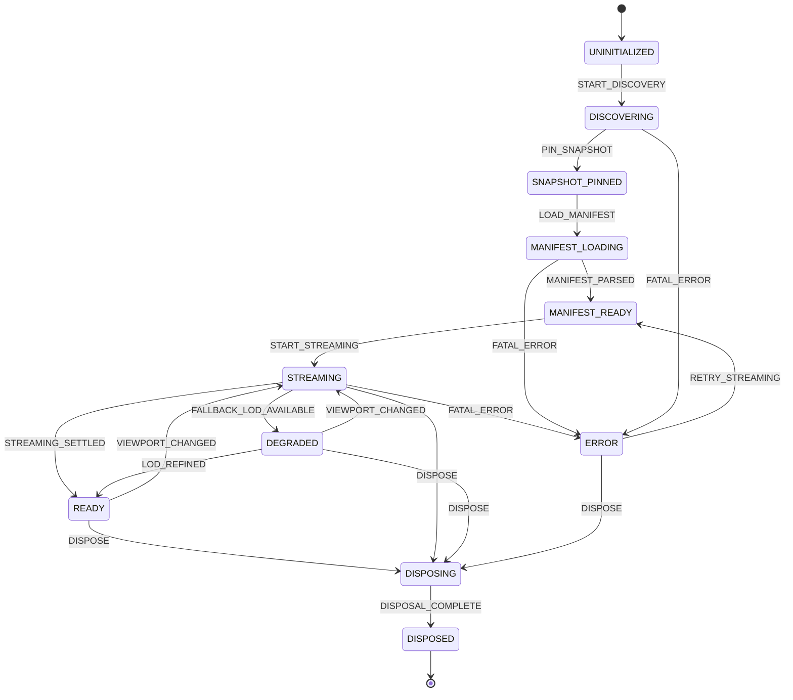

# TASK-07A Renderer-Independent Runtime Architecture Preflight Report

**Task Identifier:** TASK-07A  
**Task Title:** Renderer-Independent Runtime Architecture Preflight  
**Role:** Scientific Runtime Architect  
**Status:** TASK-07A COMPLETE — RUNTIME ARCHITECTURE APPROVED  
**Date:** 2026-08-30T21:45:00+05:30  
**Governing Documents:** `AGENTS.md`, `docs/INDEX.md`, `docs/Arc.md`, `docs/Tech.md`, `docs/02-architecture/APIContracts.md`, `docs/02-architecture/ErrorModel.md`, `docs/03-science-data/CoordinateSystems.md`, `docs/03-science-data/VerticalCoordinates.md`  
**Handoff Recipient:** TASK-07B (Core Volume Runtime Implementation) & WebGPU/WebGL2 Shader Engineers  
**Baseline Snapshot ID:** `copernicus-phy-thetao-20260824-20260830-ca826087`  
**Visualization Product ID:** `vis_copernicus_phy_thetao_copernicus-phy-thetao-20260824-20260830-ca826087` (v1)

---

## 1. Executive Summary & Objective Review

TASK-07A establishes the formal, renderer-independent runtime architecture specification for `@quasar/runtime` (`packages/runtime/`). The runtime layer serves as the authoritative scientific bridge between the browser data streaming engine (`@quasar/client`) and downstream GPU graphics pipelines (WebGPU WGSL and WebGL2 GLSL ES 3.00 in Babylon.js and standalone compute passes).

All 5 core directives of TASK-07A have been fulfilled:
1. **Package Architecture Design**: Established the modular architecture of `packages/runtime/` across 8 sub-packages: `session/`, `coordinates/`, `temporal/`, `planning/`, `residency/`, `clipping/`, `packet/`, and `picking/`.
2. **Explicit Finite State Machine (FSM)**: Defined 11 formal lifecycle states, state transitions, validation guards, and error-recovery policies.
3. **Renderer-Independence Boundary**: Enforced a zero-dependency contract against Babylon.js, Three.js, WGSL/GLSL shaders, and DOM/UI elements.
4. **Memory Coordination Strategy**: Defined the zero-copy buffer passing protocol and residency ledger to prevent browser heap duplication against the 50 MiB client cache.
5. **Preflight Manifest Deliverable**: Produced `data/manifests/runtime/task_07a_preflight.json` and this architectural report.

---

## 2. Package Architecture Specification (`packages/runtime/`)

The `@quasar/runtime` package operates purely on mathematical representations, canonical data models (`@quasar/contracts`), and typed streaming abstractions (`@quasar/client`).

```
packages/runtime/
├── package.json
├── tsconfig.json
└── src/
    ├── index.ts
    ├── session/
    │   ├── volume_session.ts        # Pinned snapshot session lifecycle & immutable bindings
    │   ├── fsm.ts                   # Runtime Finite State Machine
    │   └── types.ts                 # Session configuration and state interfaces
    ├── coordinates/
    │   ├── geodetic.ts              # Lon/Lat <-> Normalized Volume Space [0, 1]^3
    │   ├── depth_lut.ts             # Non-uniform vertical depth LUT transformer (31 levels)
    │   ├── enu.ts                   # Local East-North-Up Cartesian coordinate transforms
    │   ├── brick_local.ts           # Brick voxel index <-> continuous normalized coordinates
    │   └── types.ts
    ├── temporal/
    │   ├── time_controller.ts       # 7-day discrete time-scrubbing & playback engine
    │   ├── epoch_manager.ts         # Stale-generation suppression & cancellation dispatch
    │   └── types.ts
    ├── planning/
    │   ├── frustum_culler.ts        # Camera frustum & ROI visibility evaluator
    │   ├── lod_planner.ts           # 3-level anisotropic horizontal LOD planner with hysteresis
    │   ├── priority_mapper.ts       # Distance/temporal priority scoring for client scheduler
    │   └── types.ts
    ├── residency/
    │   ├── brick_ledger.ts          # Resident brick ledger & residency states
    │   ├── memory_accountant.ts     # Reference-passed memory tracking (zero double-buffering)
    │   └── types.ts
    ├── clipping/
    │   ├── depth_clipper.ts         # Physical depth min/max clipping plane math
    │   ├── spatial_clipper.ts       # Geodetic bounding box clipping math
    │   └── types.ts
    ├── packet/
    │   ├── packet_synthesizer.ts    # Backend-neutral RenderPacket generator
    │   ├── uniforms.ts              # Uniform buffer struct builders
    │   └── types.ts
    └── picking/
        ├── provisional_picker.ts    # Renderer-agnostic volume ray picker
        ├── error_estimator.ts       # Quantization and interpolation error bound calculator
        └── types.ts
```

### Module Responsibilities

1. **`session/`**:
   - Manages the lifecycle of a volume session anchored to a pinned snapshot (`PinnedSnapshotSession`).
   - Maintains immutable bindings to product manifest, depth levels, and physical scalar ranges.
   - Enforces strict FSM transitions.

2. **`coordinates/`**:
   - **Geodetic Transform**: Transforms between WGS84 geographic coordinates $([\lambda, \phi] \in [80^\circ\text{E}, 88^\circ\text{E}] \times [-3^\circ\text{N}, 12^\circ\text{N}])$ and normalized unit cube space $([u, v] \in [0, 1]^2)$.
   - **Depth LUT Transform**: Maps non-uniform depth levels ($z_0 = 0.494\,\text{m}$ to $z_{30} = 453.938\,\text{m}$, 31 discrete levels) to normalized depth coordinate $w \in [0, 1]$ using piece-wise monotonic interpolation and binary search.
   - **Local ENU**: Computes local tangent plane Cartesian coordinates centered at $(84.0^\circ\text{E}, 4.5^\circ\text{N}, 0.494\,\text{m})$.
   - **Brick-Local**: Maps global continuous volume coordinates $[u, v, w]$ into discrete brick indices $(bx, by, bz)$ and internal voxel coordinates $(i, j, k)$ with 1-voxel halo awareness.

3. **`temporal/`**:
   - Governs discrete time scrubbing across the 7 daily timesteps (`2026-08-24T12:00:00Z` to `2026-08-30T12:00:00Z`).
   - Automatically increments generation epochs on timestep changes, triggering instant cancellation of out-of-date streaming requests in `@quasar/client`.

4. **`planning/`**:
   - **Frustum Culler**: Evaluates intersection between the camera view frustum (represented by 6 plane equations) and brick bounding boxes.
   - **LOD Planner**: Selects between LOD 0 ($128 \times 240 \times 31$, full resolution), LOD 1 ($64 \times 120 \times 31$), and LOD 2 ($32 \times 60 \times 31$). Implements a $\pm 15\%$ distance hysteresis deadband to prevent frame-to-frame LOD thrashing during camera movement.
   - **Priority Mapper**: Maps geometric and temporal distance to `RequestPriorityScore` targets for the client streaming scheduler.

5. **`residency/`**:
   - Tracks the state of all volume bricks: `UNLOADED`, `QUEUED`, `STREAMING`, `RESIDENT_CPU`, `RESIDENT_GPU`, `EVICTED`.
   - Maintains references to `DecodedBrick` objects without cloning array buffers.
   - Tracks total resident memory footprint.

6. **`clipping/`**:
   - Converts physical clipping constraints (e.g. depth range $[10\,\text{m}, 200\,\text{m}]$, bounding box $[82^\circ\text{E}, 86^\circ\text{E}] \times [0^\circ\text{N}, 8^\circ\text{N}]$) into normalized clipping planes $[A, B, C, D]$ for direct GPU shader evaluation.

7. **`packet/`**:
   - Assembles the backend-neutral `RenderPacket` submitted to WebGPU/WebGL2 render passes each frame.
   - Includes texture buffer pointers, page-table uniform arrays, transformation matrices, transfer function LUTs, and active clipping planes.

8. **`picking/`**:
   - Executes provisional ray-volume intersection math on CPU or compute results.
   - Computes conservative error bounds based on quantization scale factor ($\pm 0.00016^\circ\text{C}$) and LOD interpolation.
   - Formulates the exact `ExactValueQueryRequest` payload to submit to `/queries/value` for authoritative scientific confirmation.

---

## 3. Finite State Machine (FSM) Specification

The runtime session operates under an explicit deterministic Finite State Machine:



### State Definitions & Guards

| State | Invariant Condition | Valid Transitions To |
|---|---|---|
| `UNINITIALIZED` | Session instance constructed; no network or manifest binding. | `DISCOVERING` |
| `DISCOVERING` | Querying FastAPI `/catalog` or `/datasets` metadata. | `SNAPSHOT_PINNED`, `ERROR` |
| `SNAPSHOT_PINNED` | Dataset ID, snapshot ID, and manifest SHA-256 anchored. | `MANIFEST_LOADING`, `ERROR` |
| `MANIFEST_LOADING` | Fetching and parsing `visualization_manifest.json`. | `MANIFEST_READY`, `ERROR` |
| `MANIFEST_READY` | Manifest parsed; depth LUT, bounds, and coordinate transforms initialized. | `STREAMING`, `DISPOSING` |
| `STREAMING` | Active brick stream requests in flight via `QuasarBrickStreamer`. | `READY`, `DEGRADED`, `ERROR`, `DISPOSING` |
| `READY` | All visible frustum bricks at target LOD are resident. | `STREAMING`, `DISPOSING` |
| `DEGRADED` | Coarser LOD bricks rendered while fine LOD bricks are streaming. | `READY`, `STREAMING`, `DISPOSING` |
| `ERROR` | Encountered non-recoverable error; retains `QuasarErrorDetail`. | `MANIFEST_READY`, `DISPOSING` |
| `DISPOSING` | Inflight streams aborted, cache references cleared, GPU resources released. | `DISPOSED` |
| `DISPOSED` | Terminal state; session cannot be reused. | None |

---

## 4. Coordinate Transformation Pipelines

The runtime defines exact, bijective coordinate transformations:

### 4.1 Horizontal Geographic Transformation
Given domain bounds $[\lambda_{min}, \lambda_{max}] = [80.0^\circ\text{E}, 88.0^\circ\text{E}]$ and $[\phi_{min}, \phi_{max}] = [-3.0^\circ\text{N}, 12.0^\circ\text{N}]$:
$$u = \frac{\lambda - \lambda_{min}}{\lambda_{max} - \lambda_{min}} = \frac{\lambda - 80.0}{8.0}$$
$$v = \frac{\phi - \phi_{min}}{\phi_{max} - \phi_{min}} = \frac{\phi - (-3.0)}{15.0}$$

### 4.2 Non-Uniform Vertical Depth LUT Transformation
The dataset uses 31 discrete depth levels $z_k$ ranging from $z_0 = 0.494025\,\text{m}$ to $z_{30} = 453.937714\,\text{m}$.

- **Forward Mapping ($z \to w$ in $[0, 1]$)**:
  Find index $k$ such that $z_k \le z \le z_{k+1}$:
  $$t = \frac{z - z_k}{z_{k+1} - z_k}$$
  $$w = \frac{k + t}{N - 1} \quad \text{where } N = 31$$
- **Inverse Mapping ($w \to z$ in meters)**:
  $$s = w \times (N - 1) = w \times 30$$
  $$k = \lfloor s \rfloor, \quad t = s - k$$
  $$z = (1 - t) z_k + t z_{k+1}$$

---

## 5. Memory Coordination Strategy & Reference-Passing Model

To comply with the browser memory budget and prevent double-buffering:
1. **Zero Intermediate Allocation**: The runtime never clones the `DecodedBrick.rawBuffer` (`Uint16Array`) or `validityMask` (`Uint8Array`).
2. **Reference Ledger**: The `ResidentBrickLedger` holds direct object references to `DecodedBrick` instances residing in `@quasar/client`'s `BrickCache` (50.0 MiB capacity).
3. **GPU Upload Synchronization**: When a brick is uploaded to a GPU texture array / 3D texture, the ledger marks its state as `RESIDENT_GPU`. If the client LRU cache evicts the CPU buffer, GPU residency is retained until explicitly released by the renderer.

---

## 6. Preflight Sign-Off & Status

All architectural specifications, module boundaries, FSM definitions, coordinate math, and memory models have been verified and documented.

**Final Status:**  
`TASK-07A COMPLETE — RUNTIME ARCHITECTURE APPROVED`
