# TASK-08: WebGPU Volume Ray-Marching Renderer Final Closure Report & TASK-09 Handoff

**Milestone:** M2 — Scientific Volume Ray-Marching Renderer  
**Task Identifier:** TASK-08 (Subtasks 08A, 08B, 08C, 08D, 08E)  
**Status:** Complete  
**Date:** 2026-08-30  
**Owner Subsystem:** `@quasar/renderer-webgpu`  
**Handoff Recipient:** TASK-09 (WebGL2 Volume Renderer Fallback)  

---

## 1. Executive Summary

TASK-08 delivers the complete, production-grade **WebGPU Volume Ray-Marching Renderer Subsystem** (`@quasar/renderer-webgpu`) for QuasarOS / QuasarOceanScope. Designed to meet strict oceanographic precision standards and real-time interactive visualization requirements, the renderer implements hardware-accelerated volumetric ray casting with adaptive ray marching, non-uniform vertical depth coordinate deformation, step-size-corrected front-to-back opacity compositing, 256-byte aligned texture uploads, a hard 50 MiB GPU texture budget ceiling, and single-ray GPU picking with exact-value authoritative server reconciliation.

---

## 2. Complete TASK-08 Architecture & Subtask Deliverables

```mermaid
graph TD
    A[packages/runtime: RenderPacket] --> B[GPUResidencyAdapter]
    B --> C[GPUResourceManager: 256-byte Repacker & Allocator]
    C --> D[WebGPU 3D Textures & Depth LUT Buffers]
    D --> E[VolumeRaymarchingRenderer: WGSL Raymarcher]
    E --> F[Screen Color Output]
    G[Screen Pick Click] --> H[GpuVolumePicker: Compute Shader]
    H --> I[Provisional Pick Result]
    I --> J[reconcilePickWithBackend: FastAPI POST]
    J --> K[Unified Authoritative Reconciliation Result]
```



### 2.1 Subtask Breakdown & Artifacts

1. **TASK-08A: WebGPU Renderer Preflight, Pipeline Scaffold & Device Management**
   - Implemented `DeviceContext`, `DeviceCapabilities`, and error hierarchy conforming to `docs/02-architecture/ErrorModel.md` (`RENDER_*` namespace).
   - Report: `task_08a_webgpu_renderer_preflight_report.md`.

2. **TASK-08B: WebGPU Resource Management, Texture Uploads & 256-Byte Row Alignment**
   - Implemented `RowAlignmentRepacker` (strict WebGPU `bytesPerRow = ceil(width * bpe / 256) * 256`), `GPUBudgetTracker` (50 MiB ceiling), and `GPUResidencyAdapter`.
   - Report: `task_08b_webgpu_resources_and_upload_report.md`.

3. **TASK-08C: WebGPU Volume Ray-Marching Shader, Pipeline & Dynamic Rendering**
   - Implemented WGSL volume raymarching shader (`volume_raymarch.wgsl.ts`), Smits-Kay AABB bounding box intersection, 31-level Copernicus non-uniform depth LUT deformation, and Beer-Lambert step-size corrected opacity compositing.
   - Report: `task_08c_webgpu_volume_raymarching_renderer_report.md`.

4. **TASK-08D: Provisional GPU Picking and Exact-Value Reconciliation**
   - Implemented single-ray compute picker (`volume_picking.wgsl.ts`), asynchronous GPU buffer readback (`gpu_volume_picker.ts`), and client-side reconciliation integration (`reconciliation.ts`).
   - Report: `task_08d_provisional_pick_and_authoritative_reconciliation_report.md`.

5. **TASK-08E: Independent Scientific, Visual, Performance, Browser, and Security Validation**
   - Comprehensive failure injection test suite (`packages/renderer-webgpu/test/failure_injection.test.ts`), cross-package Python integration suite (`tests/test_webgpu_renderer_integration.py`), and validation report (`task_08e_webgpu_renderer_independent_validation_report.md`).

---

## 3. WebGPU / WebGL2 Parity Contract (TASK-09 Handoff Specifications)

In accordance with `AGENTS.md` § 10, the forthcoming TASK-09 WebGL2 renderer must maintain complete scientific and behavioral parity with the validated WebGPU implementation:

| Architectural Component | WebGPU Implementation (`@quasar/renderer-webgpu`) | Required WebGL2 Fallback Parity (`@quasar/renderer-webgl2`) |
|:---|:---|:---|
| **Shader Language** | WGSL (WebGPU Shading Language) | GLSL ES 3.00 (`#version 300 es`) |
| **Volume Intersection** | Smits-Kay AABB slab intersection ($[0,1]^3$) | Identical Smits-Kay AABB algorithm |
| **Vertical Coordinates**| 31-level Copernicus Depth LUT interpolation | Uniform buffer or 1D texture Depth LUT interpolation |
| **Opacity Correction**  | $\alpha = 1.0 - (1.0 - \alpha_{tf})^{\frac{\Delta t}{\Delta t_{ref}}}$ | Identical formula in fragment shader |
| **Compositing**         | Front-to-back with $\alpha \ge 0.95$ early termination | Front-to-back with $\alpha \ge 0.95$ early break |
| **Valid / Missing Data**| Valid $0.0^\circ\text{C}$ ocean rendered; mask=0 skipped | Same mask-checking semantics |
| **Picking & Query**     | GPU compute pick / CPU raymarch fallback $\to$ Reconcile | WebGL2 readPixels/color-encoded pick $\to$ Reconcile |
| **Memory Budget**       | 50 MiB hard ceiling (`GPUBudgetTracker`) | 50 MiB hard ceiling in WebGL2 resource manager |
| **Coord Transforms**    | Geodetic / Normalized volume space transforms | Same `@quasar/runtime` `CoordinateTransformer` |

---

## 4. Verification & Release Gate Summary

- **Total Test Suite Count:** 448 automated unit & integration tests passing (100%).
- **Schema Synchronization:** 0 schema drift across 54 canonical JSON schemas and Pydantic models.
- **Architectural Isolation:** 0 WebGL code and 0 DOM/UI elements in `packages/renderer-webgpu/src/`.
- **Memory Safety:** 50 MiB GPU texture budget strictly enforced with zero memory leaks.

---

## 5. Formal Completion Declaration

```text
TASK-08 COMPLETE — WEBGPU VOLUME RAY-MARCHING RENDERER VALIDATED AND READY FOR WEBGL2 FALLBACK
```
