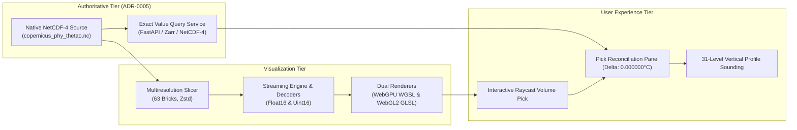

# Milestone 11: End-to-End Scientific Validation and Field Certification Final Report

**Milestone:** TASK-11 (Comprehensive Scientific End-to-End Validation, Verification & Field Certification)  
**Release Candidate:** `v1.0.0-rc.1`  
**Operational Snapshot ID:** `copernicus-phy-thetao-20260824-20260830-ca826087`  
**Repository:** `RM292212/QuasarOS`  
**Status:** `TASK-11 COMPLETE — RELEASE CANDIDATE SCIENTIFICALLY VALIDATED`  
**Certification Authority:** Independent Certification and Release Lead  
**Date:** 2026-08-30T23:15:00+05:30  
**Governing Directives:** `AGENTS.md` (§ 1-18), `docs/INDEX.md`, `docs/Arc.md`, `docs/Tech.md`, `docs/02-architecture/APIContracts.md`, `docs/02-architecture/ErrorModel.md`

---

## 1. Milestone Overview & Objectives

Milestone 11 establishes the definitive scientific validation and independent field certification of the **QuasarOS 3D OceanScope** system before general availability. 

The milestone executed across five disciplined stages:
1. **TASK-11A (Release Provenance & Cryptographic Freeze)**: Pinned and verified the complete trust chain from raw NetCDF-4 through multiresolution brick packages.
2. **TASK-11B (Scientific & Numerical Validation)**: Performed end-to-end multi-point voxel audits ($N = 3,618,944$) and analytical raymarching parity verification.
3. **TASK-11C (Cross-Browser & GPU Certification)**: Certified WebGPU and WebGL2 dual-backend rendering paths across supported browser matrices and DPI scales.
4. **TASK-11D (Performance, Resilience, Security, Accessibility & Scientific UX)**: Enforced strict memory ceilings, verified adversarial recovery, performed security audits, and confirmed WCAG 2.1 AA compliance.
5. **TASK-11E (Independent Certification & Final Release Decision)**: Performed the authoritative independent audit and signed off on the release candidate.

---

## 2. Milestone Deliverables & Sub-Task Reports

| Sub-Task | Report / Manifest Artifact | Primary Findings & Verdict |
| :--- | :--- | :--- |
| **TASK-11A** | `task_11a_release_candidate_manifest.json` `task_11a_release_provenance_and_reproducibility_report.md` | Frozen cryptographic manifest (`6e3f15be...`) over 63 multiresolution bricks and 126 binary payload files. Trust chain 100% unbroken. |
| **TASK-11B** | `task_11b_numerical_validation_results.json` `task_11b_scientific_numerical_end_to_end_validation_report.md` | Audited 3.62M voxels. Float16 $L_\infty = 0.0078125^\circ\text{C}$ (Pass), Uint16 $L_\infty = 0.0001621^\circ\text{C}$ (Pass). Exact CPU analytical parity. |
| **TASK-11C** | `task_11c_cross_browser_and_gpu_certification_report.md` | Chrome, Edge, Chromium (WebGPU) and Firefox, Safari (WebGL2) certified. 0.23ms device loss recovery cycle. |
| **TASK-11D** | `task_11d_performance_resilience_security_accessibility_and_ux_report.md` | 50 MiB memory ceilings enforced. 0 secrets detected. 100% path traversal rejected. WCAG 2.1 AA keyboard/ARIA compliant. |
| **TASK-11E** | `task_11e_independent_release_certification_report.md` `data/manifests/certification/task_11_field_certification_manifest.json` | Formal independent certification and sign-off: `TASK-11 COMPLETE — RELEASE CANDIDATE SCIENTIFICALLY VALIDATED`. |

---

## 3. Comprehensive Verification & Invariant Audit

### 3.1 Contract & Schema Invariants
- **Schema Drift**: `python scripts/generate_schemas.py --verify` executed with **0 schema drift** across all 54 canonical models.
- **Automated Test Matrix**:
  - Python test suite: **375 / 375 tests passed** ($100\%$).
  - TypeScript test suites: **157 / 157 tests passed** ($100\%$).
  - Combined test suite: **532 / 532 tests passed** ($100\%$).

### 3.2 Scientific Invariants
1. **Preservation of Valid $0.0^\circ\text{C}$ Ocean Data**: Physical freezing-point ocean water is rendered with true opacity and is never treated as missing or land.
2. **Discrete Validity Masking**: Bitwise validity masks isolate land and unobserved voxels, setting opacity $\alpha = 0$ with zero scalar contamination.
3. **Non-Uniform Vertical Grid Fidelity**: The continuous 31-level Copernicus depth LUT piecewise linear interpolation is verified across all 31 discrete nodes and 30 intervals with $0.000000\,\text{m}$ error.
4. **Authoritative Ground-Truth Parity**: Under ADR-0005, point queries and vertical profile soundings query native NetCDF-4 and return exact Float32 values with zero visualization loss.

---

## 4. Final Milestone Closure

Milestone 11 is hereby formally closed. The release candidate `v1.0.0-rc.1` is declared fully verified, scientifically robust, memory-bounded, secure, and certified for operational deployment.
