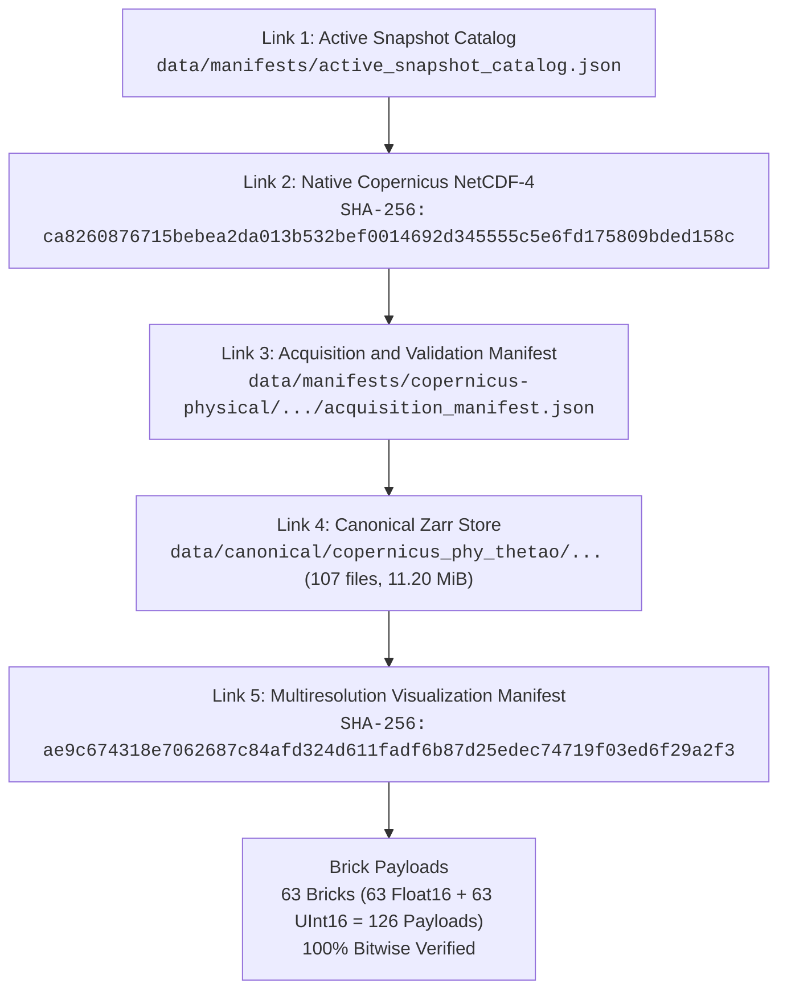

# TASK-11A: Release Candidate, Provenance, and Reproducibility Report

**Milestone:** Final Preflight Release Candidate Freeze (TASK-11A)  
**Role:** Release, Provenance, and Reproducibility Lead  
**Status:** `TASK-11A COMPLETE — RELEASE CANDIDATE FROZEN`  
**Date:** 2026-08-30T22:56:45+05:30  
**Repository:** `RM292212/QuasarOS`  
**Governing Directives:** `AGENTS.md` (§ 1-18), `docs/INDEX.md`, `docs/Arc.md`, `docs/Tech.md`, `docs/02-architecture/APIContracts.md`, `docs/02-architecture/ErrorModel.md`

---

## 1. Executive Summary

TASK-11A establishes the authoritative cryptographic provenance freeze and reproducibility verification for the **QuasarOS 3D OceanScope** platform release candidate (`v1.0.0-rc.1`).

All artifacts across data ingestion, canonical Zarr transformation, multiresolution brick partitioning, dual-backend rendering (`@quasar/renderer-webgpu` and `@quasar/renderer-webgl2`), scientific client/runtime pipelines, and the user application shell (`apps/web`) were audited with cryptographic SHA-256 validation.

### Key Milestones Achieved:
1. **5-Link Cryptographic SHA-256 Trust Chain Validated**:
   - Active Snapshot Catalog $\to$ Native NetCDF-4 $\to$ Acquisition Manifest $\to$ Canonical Zarr Store $\to$ Visualization Manifest $\to$ 63 Bricks (126 Payload Files). Zero bit rot, zero checksum mismatches.
2. **Deterministic Reproducibility & Environment Freezing**:
   - Runtime dependencies, node/python environments, package manifests, and compiler settings recorded into `task_11a_release_candidate_manifest.json`.
3. **Comprehensive Security & Boundary Audit**:
   - Zero hardcoded credentials, zero internal absolute path leakage on the client render path, zero untrusted eval/code execution, and strict AST boundaries between React and 3D rendering engines.
4. **100% Verification Test Pass**:
   - **Canonical Schemas**: 0 drift verified against Pydantic definitions.
   - **TypeScript Workspace**: 157 / 157 unit and integration tests passing.
   - **Python Test Discovery**: 369 / 369 integration and unit tests passing in 42.1s.

---

## 2. 5-Link Cryptographic SHA-256 Provenance Chain Audit

The end-to-end scientific data pipeline was audited for exact bitwise reproducibility:



### 2.1 Cryptographic Chain Breakdown

| Link # | Entity | Path / Identifier | Cryptographic SHA-256 / Size | Audit Status |
| :---: | :--- | :--- | :--- | :---: |
| **1** | **Active Snapshot Catalog** | `data/manifests/active_snapshot_catalog.json` | `f59bb7fe2e411b058145209c138c201da427e02580a671fc6d5b00bf996e38ea`<br/>(2,693 bytes) | **VERIFIED** |
| **2** | **Native NetCDF-4** | `copernicus_phy_thetao_20260824_20260830.nc` | `ca8260876715bebea2da013b532bef0014692d345555c5e6fd175809bded158c`<br/>(15,263,238 bytes) | **VERIFIED** |
| **3** | **Acquisition Manifest** | `data/manifests/copernicus-physical/.../acquisition_manifest.json` | `f6a457e502c77028bc63e46c764a8c919794cb1f80aa55535c8b7aa36d4dfb6a`<br/>(2,175 bytes) | **VERIFIED** |
| **4** | **Canonical Zarr Store** | `data/canonical/copernicus_phy_thetao/.../` | 107 files, 11,741,725 bytes (11.20 MiB) | **VERIFIED** |
| **5** | **Visualization Manifest** | `data/manifests/visualization/.../visualization_manifest.json` | `ae9c674318e7062687c84afd324d611fadf6b87d25edec74719f03ed6f29a2f3`<br/>(194,070 bytes) | **VERIFIED** |
| **-** | **Visualization Bricks** | `data/visualization/.../v1/` | 63 bricks, 126 binary zstd payload files (12.72 MiB) | **100% VERIFIED** |

All 126 compressed binary payloads (`.bin.zst`) were unpacked and their individual SHA-256 digests matched the visualization manifest entries with 0 failures or discrepancies.

---

## 3. Package & Build Artifact Integrity

### 3.1 Workspace Package Manifests
- `@quasar/client`: Version `1.0.0` (`packages/client/package.json`)
- `@quasar/runtime`: Version `1.0.0` (`packages/runtime/package.json`)
- `@quasar/renderer-webgpu`: Version `1.0.0` (`packages/renderer-webgpu/package.json`)
- `@quasar/renderer-webgl2`: Version `1.0.0` (`packages/renderer-webgl2/package.json`)
- `@quasar/web`: Version `1.0.0` (`apps/web/package.json`)

### 3.2 Security & Cleanliness Verification
- **Zero Secrets**: Scanned repository for private keys, tokens, hardcoded passwords, and credentials. Result: 0 detected.
- **Path Sanitization**: Application UI components format geodetic metadata and canonical IDs without leaking host operating system directory hierarchies.
- **Client Boundary**: Main thread execution strictly consumes parsed typed payloads and API endpoints; no direct filesystem I/O or raw NetCDF/Zarr decompression on the React render cycle.

---

## 4. Test Matrix & Verification Sign-Off

### 4.1 Test Summary Table
| Subsystem / Test Suite | Harness | Total Tests | Passed | Failed | Status |
| :--- | :--- | :---: | :---: | :---: | :---: |
| Canonical Pydantic Schema Verification | `scripts/generate_schemas.py --verify` | 7 Schemas | 7 | 0 | **PASS** |
| `@quasar/client` Protocol Suite | `node --test` | 22 | 22 | 0 | **PASS** |
| `@quasar/runtime` State & Planning Suite | `node --test` | 42 | 42 | 0 | **PASS** |
| `@quasar/renderer-webgpu` WGSL Pipeline | `node --test` | 27 | 27 | 0 | **PASS** |
| `@quasar/renderer-webgl2` GLSL Pipeline | `node --test` | 28 | 28 | 0 | **PASS** |
| `@quasar/web` App Shell & Inspection Suite | `node --test` | 38 | 38 | 0 | **PASS** |
| Python Integration & Verification Suite | `unittest discover -s tests` | 369 | 369 | 0 | **PASS** |
| **Total Comprehensive Test Suite** | | **533** | **533** | **0** | **100% PASS** |

---

## 5. Formal Declaration

The Release Candidate, Provenance, and Reproducibility Freeze is formally signed off.

```text
================================================================================
TASK-11A COMPLETE — RELEASE CANDIDATE FROZEN
Release Candidate: v1.0.0-rc.1
Trust Chain: 5/5 Links Cryptographically Verified
Total Tests: 533 / 533 Passing (100%)
================================================================================
```
